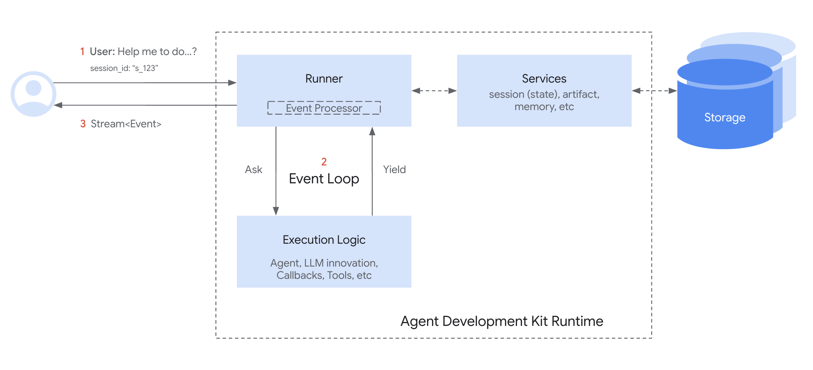
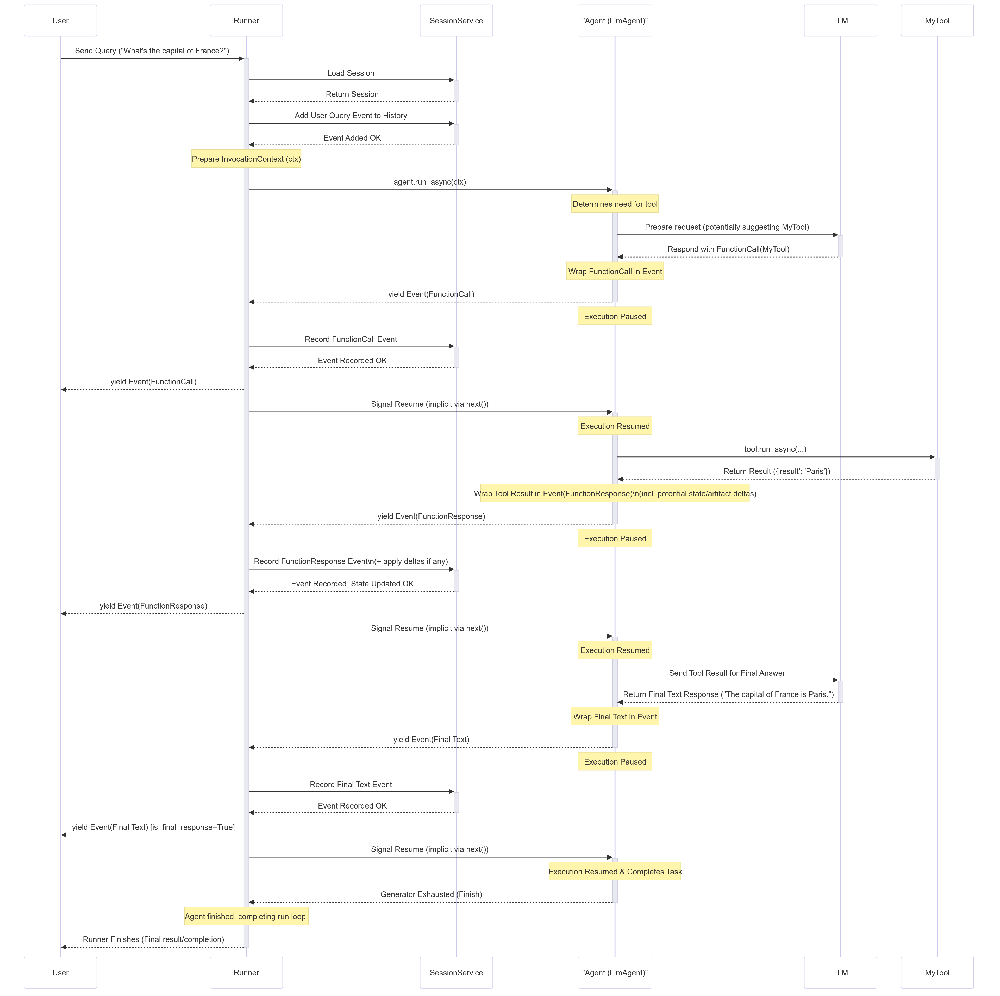

# Module 6: Running an Agent Programmatically

## Theory

### Beyond the Dev UI: Production Execution

While the `adk web` Dev UI is an excellent tool for interactive testing, it's not designed for production use. To integrate your agent into a larger application, a backend service, or a custom user interface, you need to run it programmatically.

Running an agent programmatically means you are responsible for managing the components that the Dev UI handles automatically. This gives you complete control over the agent's lifecycle and how it integrates with your application.

### Core Components for Programmatic Execution

When you run an agent outside the Dev UI, you need to explicitly create and manage three key components:

1.  **The Session Service (`InMemorySessionService`)**
    *   **Feature:** Conversation history & shared state.
    *   **Description:** Sessions are crucial for maintaining conversational context. They store the history of messages and any stateful information the agent needs to remember between turns. Before creating a `Runner`, you must first instantiate a session service. The `InMemorySessionService` is a simple, non-persistent store that keeps session data in memory, perfect for development and simple applications. For production, you would use a persistent service like `FirestoreSessionService`.

2.  **Runners: Executing Your Agents (`Runner`, `InMemoryRunner`)**
    *   **Feature:** Oversight of agent execution.
    *   **Description:** A Runner is responsible for the actual execution of an agent. It takes user input, manages the session, invokes the appropriate agent, and streams back the events generated by the agent.

    *   **`google.adk.runners.Runner`:** This is the primary class for running agents. It is a stateless orchestrator that requires an `app_name`, the `root_agent` to run, and instances of various services (like `SessionService`, `ArtifactService`, `MemoryService`) to be passed to its constructor. This is the class you will use for production applications where you need to connect to persistent, production-grade services.

    *   **`google.adk.runners.InMemoryRunner`:** This is a convenient subclass of `Runner` that comes pre-configured with in-memory implementations for `SessionService`, `ArtifactService`, and `MemoryService`. This is ideal for quick local development, testing, and examples where persistence is not required.

    **`InMemoryRunner` vs. `Runner`**
    Use `InMemoryRunner` for quick local tests and examples. Switch to the base `Runner` class when you need to integrate with persistent services like `FirestoreSessionService` for more robust applications. The lab for this module will use the base `Runner` to teach you how the components fit together.

    **Example with `InMemoryRunner`:**
    ```python
    from google.adk.runners import InMemoryRunner
    from google.adk.agents import LlmAgent
    from google.genai.types import Content, Part

    root_agent = LlmAgent(name="my_agent", model="gemini-2.5-flash", instruction="Be helpful.")
    runner = InMemoryRunner(agent=root_agent, app_name="MyApp")

    # Conceptual usage for run_async:
    # async for event in runner.run_async(
    #     user_id="user123",
    #     session_id="sessionXYZ",
    #     new_message=Content(parts=[Part(text="Hello")])
    # ):
    #     print(event)
    ```

3.  **Structured Messages (`types.Content` and `types.Part`)**
    *   **Feature:** Structured, multimodal messages.
    *   **Description:** Instead of passing a simple string to the agent, you must package it in a structured `Content` object from the `google.genai` library. A `Content` object has a `role` (`'user'`, `'model'`, or `'tool'`) and a list of `parts`. Each `Part` can contain text, an image, or other data. This structure is what allows for rich, multimodal interactions with the underlying Gemini model.

### The Asynchronous Event Loop

The entire process is asynchronous. When you call `runner.run_async()`, you don't get a single response back. Instead, you get an asynchronous generator that yields `Event` objects as they happen.

Your application code will typically use an `async for` loop to iterate through these events and decide how to handle them. For a simple chatbot, you might just print the text from the final `'model'` response event. For a more complex application, you might inspect `'tool'` events to show a spinner in the UI while a tool is running.

To better visualize this flow, consider the following conceptual diagram:

```
$$\\text{User Query} \\xrightarrow{\\text{Runner}} \\text{Agent} \\xrightarrow{\\text{LLM/Tools}} \\text{Event Stream} \\xrightarrow{\\text{App Logic}} \\text{Response}$$
```

This highlights the Runner's central role as the orchestrator. For a more detailed visual explanation, refer to these diagrams:





By managing these components yourself, you gain the power to embed your ADK agent into any Python application, from a simple command-line interface to a complex, scalable web service.

### Key Takeaways
- Programmatic execution gives you full control over the agent's lifecycle for integration into custom applications.
- The `Runner` is a stateless engine that requires services, like a `SessionService`, to be passed into it.
- The `InMemoryRunner` is a convenient subclass of `Runner` with pre-configured in-memory services for rapid development.
- The `InMemorySessionService` is used to create and manage sessions in memory for development.
- User messages must be packaged into structured `types.Content` and `types.Part` objects.
- The `runner.run_async()` method returns an asynchronous stream of `Event` objects that you process in a loop.
